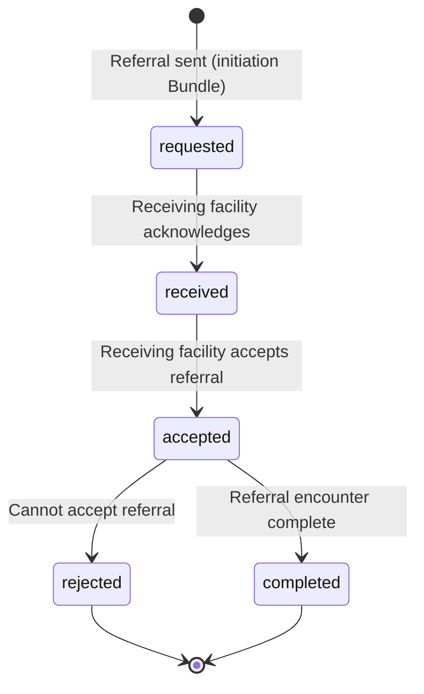

# Sample Case: Ana Reyes eReferral — Initiation and Workflow Tutorial

> **Target Audience:** Connectathon participants, implementers, and developers learning how to create, send, and trace an eReferral using the PH eReferral IG profiles against a FHIR server.
>
> **Prerequisite:** Familiarity with basic FHIR concepts (resources, references, Bundles). If you are new to FHIR, read [What is FHIR?](https://www.hl7.org/fhir/overview.html) first.

**Test Server (REST API):** `https://cdr.fhirlab.net/fhir`  
**Terminology Server (Code Lookup):** `https://tx.fhirlab.net/fhir`

This tutorial walks you through the complete eReferral initiation workflow using **20 bundled resources** in a single transaction. You will learn how the pieces connect, what codes are used, and how to trace the referral from creation through task state progression.

---

## Table of Contents

1. [The Case Scenario](#the-case-scenario)
2. [Resource Relationship Diagram](#resource-relationship-diagram)
3. [Looking Up Codes at tx.fhirlab.net](#looking-up-codes-at-txfhirlabnet)
4. [The Transaction Bundle — POST /fhir](#the-transaction-bundle--post-fhir)
5. [Reading Back Resources](#reading-back-resources)
6. [Searching for Referrals](#searching-for-referrals)
7. [Tracing the Workflow — Task State Progression](#tracing-the-workflow--task-state-progression)
8. [Complete cURL Commands](#complete-curl-commands)
9. [Key Takeaways](#key-takeaways)
10. [Links to Rendered Artifacts](#links-to-rendered-artifacts)

---

## The Case Scenario

**Ana Luisa Reyes**, a 38-year-old pregnant woman (G2P1, 32 weeks AOG), presents to **Kalibo Health Center (KHC)** with severe headache, dizziness, blurring of vision, chest tightness, and epigastric pain persisting for two days.

### Clinical Summary

| Detail | Value |
|--------|-------|
| **Patient** | Ana Luisa Reyes, 38F, DOB 12 March 1988 |
| **Address** | Area 4, Barangay Mabuhay, Kalibo, Aklan |
| **PhilHealth ID** | 78-658064775-3 |
| **PhilSys ID** | 7731-0812-4491-0326 |
| **Blood Pressure** | 180/110 mmHg (Severe Hypertension) |
| **Heart Rate** | 112 bpm |
| **Respiratory Rate** | 24/min |
| **SpO₂** | 96% |
| **Temperature** | 36.8°C |
| **Weight** | 72 kg |
| **Laboratory** | Urinalysis: Proteinuria 3+ |
| **Working Impression** | G2P1(1001), Pregnancy Uterine, 32 weeks AOG — Severe Pre-eclampsia |
| **Initial Treatment** | Methyldopa 250mg BID, Folic Acid 5mg OD, FeSO₄ 300mg OD, CaCO₃ 500mg TID |
| **Referring Provider** | Dr. Maria Villanueva, Primary Care Physician |
| **Referring Facility** | Kalibo Health Center (NHFR: 042-CHC-0087) |
| **Receiving Facility** | Dr. Rafael S. Tumbokon Memorial Hospital — RSTMH (NHFR: 042-DH-0012) |
| **Referral Category** | Emergency |
| **Reason Category** | Procedure |

### What This Referral Models

This is a **referral initiation** — the moment Kalibo Health Center determines Ana needs higher-level care and sends the referral to RSTMH. It is modeled as a **FHIR transaction Bundle** containing 20 entries that together form a complete, self-contained referral payload.

---

## Resource Relationship Diagram

The diagram below shows how the 20 resources in the submission Bundle connect to each other. Arrows represent FHIR `reference` fields.

```mermaid
graph TD
    subgraph "People & Places"
        PAT[Patient<br/>Ana Reyes]
        PRAC[Practitioner<br/>Dr. Villanueva]
        ORG_KHC[Organization<br/>Kalibo Health Center]
        ORG_RSTMH[Organization<br/>RSTMH]
        PR_KHC[PractitionerRole<br/>Dr. Villanueva @ KHC]
        PR_RSTMH[PractitionerRole<br/>Receiving @ RSTMH]
    end

    subgraph "Clinical Context"
        ENC[Encounter<br/>KHC PCF Visit]
        COND_CC[Condition<br/>Chief Complaint]
        COND_DX[Condition<br/>Severe Pre-eclampsia]
        OBS_BP[Observation<br/>BP 180/110]
        OBS_HR[Observation<br/>HR 112]
        OBS_RR[Observation<br/>RR 24]
        OBS_O2[Observation<br/>SpO2 96%]
        OBS_TEMP[Observation<br/>Temp 36.8]
        OBS_WT[Observation<br/>Wt 72 kg]
        PROC[Procedure<br/>Pre-referral Treatment]
        DR[DiagnosticReport<br/>Urinalysis]
    end

    subgraph "Referral & Workflow"
        SR[ServiceRequest<br/>eReferral to RSTMH]
        TASK[Task<br/>Requested]
        PROV[Provenance<br/>Signature]
    end

    PAT --> ENC
    PRAC --> PR_KHC
    ORG_KHC --> PR_KHC
    ORG_RSTMH --> PR_RSTMH

    ENC --> COND_CC
    ENC --> COND_DX
    ENC --> OBS_BP
    ENC --> OBS_HR
    ENC --> OBS_RR
    ENC --> OBS_O2
    ENC --> OBS_TEMP
    ENC --> OBS_WT
    ENC --> PROC
    ENC --> DR
    ENC --> SR

    COND_CC --> PAT
    COND_DX --> PAT
    OBS_BP --> PAT
    OBS_HR --> PAT
    OBS_RR --> PAT
    OBS_O2 --> PAT
    OBS_TEMP --> PAT
    OBS_WT --> PAT
    PROC --> PAT
    DR --> PAT

    SR --> PAT
    SR --> PR_KHC
    SR --> PR_RSTMH
    SR --> COND_DX
    SR --> ENC

    TASK --> SR
    TASK --> PAT
    TASK --> PR_KHC
    TASK --> PR_RSTMH

    PROV --> SR
    PROV --> PR_KHC
    PROV --> ORG_KHC

    style PAT fill:#e1f5fe
    style PRAC fill:#e8f5e9
    style ORG_KHC fill:#fff3e0
    style ORG_RSTMH fill:#fff3e0
    style PR_KHC fill:#e8f5e9
    style PR_RSTMH fill:#e8f5e9
    style ENC fill:#f3e5f5
    style COND_DX fill:#fce4ec
    style COND_CC fill:#fce4ec
    style OBS_BP fill:#fff9c4
    style OBS_HR fill:#fff9c4
    style OBS_RR fill:#fff9c4
    style OBS_O2 fill:#fff9c4
    style OBS_TEMP fill:#fff9c4
    style OBS_WT fill:#fff9c4
    style PROC fill:#e0f2f1
    style DR fill:#e0f2f1
    style SR fill:#ffebee
    style TASK fill:#ede7f6
    style PROV fill:#efebe9
```



### Reference Rules in This Bundle

- Every clinical resource points to the **Patient** via `subject` and the **Encounter** via `encounter`
- The **ServiceRequest** (`requester`) points to the referring facility's PractitionerRole
- The **ServiceRequest** (`performer`) points to the receiving facility's PractitionerRole
- The **Task** (`focus`) points to the ServiceRequest and (`owner`) points to the receiving PractitionerRole
- The **Provenance** (`target`) attests to the ServiceRequest
- All intra-Bundle references use `urn:uuid:` temporary identifiers resolved by the server

---

## Looking Up Codes at tx.fhirlab.net

The eReferral IG uses codes from multiple terminology systems. Here is how to verify them interactively.

### Terminology Systems Used

| System URL | Name | What It Codes |
|------------|------|---------------|
| `http://snomed.info/sct` | SNOMED CT | Clinical findings, procedures, body sites |
| `http://loinc.org` | LOINC | Observations, lab panels, document types |
| `https://psa.gov.ph/classification/psgc` | PSGC | Philippine geographic codes (region, province, city, barangay) |
| `http://philhealth.gov.ph/fhir/Identifier/philhealth-id` | PhilHealth ID | National health insurance identifiers |
| `http://philsys.gov.ph/fhir/Identifier/philsys-id` | PhilSys ID | National identification system |
| `http://terminology.hl7.org/CodeSystem/condition-clinical` | Condition Clinical Status | active, recurrence, relapse, inactive, remission, resolved |
| `http://terminology.hl7.org/CodeSystem/condition-ver-status` | Condition Verification | unconfirmed, provisional, differential, confirmed, refuted, entered-in-error |
| `http://terminology.hl7.org/CodeSystem/condition-category` | Condition Category | problem-list-item, encounter-diagnosis |
| `http://terminology.hl7.org/CodeSystem/observation-category` | Observation Category | vital-signs, laboratory, imaging, survey, etc. |
| `http://terminology.hl7.org/CodeSystem/v3-ActCode` | HL7 v3 ActCode | Encounter class (AMB, EMER, IMP, etc.) |
| `http://terminology.hl7.org/CodeSystem/v3-RoleCode` | HL7 v3 RoleCode | Contact relationships (HUSB, WIFE, etc.) |
| `http://terminology.hl7.org/CodeSystem/v3-DataOperation` | HL7 v3 DataOperation | Provenance activity (CREATE, UPDATE, etc.) |
| `urn:iso-astm:E1762-95:2013` | Signature Type Codes | Digital signature types |

### Code Lookup Commands

Look up a SNOMED CT concept by code:

```bash
curl -s "https://tx.fhirlab.net/fhir/CodeSystem/\$lookup?system=http://snomed.info/sct&code=398254007" \
  -H "Accept: application/fhir+json" | jq .
```

This returns the display name and properties for "Pre-eclampsia" (SNOMED 398254007).

Look up a PSGC geographic code:

```bash
curl -s "https://tx.fhirlab.net/fhir/CodeSystem/\$lookup?system=https://psa.gov.ph/classification/psgc&code=0600400000" \
  -H "Accept: application/fhir+json" | jq .
```

Verify a LOINC observation code:

```bash
curl -s "https://tx.fhirlab.net/fhir/CodeSystem/\$lookup?system=http://loinc.org&code=85354-9" \
  -H "Accept: application/fhir+json" | jq .
```

### Key SNOMED CT Codes in This Referral

<div class="ph-table" markdown="1">

| Code | Display | Where Used |
|------|---------|------------|
| `398254007` | Pre-eclampsia | Working impression diagnosis |
| `25064002` | Headache | Chief complaint |
| `75367002` | Blood pressure | BP observation co-coding |
| `78564009` | Pulse rate | Heart rate observation |
| `86290005` | Respiratory rate | Respiratory rate observation |
| `103228002` | Hemoglobin saturation with oxygen | SpO₂ observation |
| `386725007` | Body temperature | Temperature observation |
| `27113001` | Body weight | Weight observation |
| `416608005` | Drug therapy | Pre-referral treatment procedure |
| `73770003` | Hospital-based outpatient emergency care center | Referral category |
| `71388002` | Procedure | Reason for referral |
| `3457005` | Patient referral | Task code |
| `158965000` | Medical practitioner | PractitionerRole code |

</div>

### Key LOINC Codes in This Referral

<div class="ph-table" markdown="1">

| Code | Display | Where Used |
|------|---------|------------|
| `85354-9` | Blood pressure panel with all children optional | BP observation magic code |
| `8480-6` | Systolic blood pressure | BP component systolic |
| `8462-4` | Diastolic blood pressure | BP component diastolic |
| `8867-4` | Heart rate | HR observation |
| `9279-1` | Respiratory rate | RR observation |
| `2708-6` | Oxygen saturation in Arterial blood | SpO₂ observation |
| `8310-5` | Body temperature | Temperature observation |
| `29463-7` | Body weight | Weight observation |
| `24356-8` | Urinalysis complete panel - Urine | Diagnostic report |

</div>

### Key PSGC Geographic Codes in This Referral

<div class="ph-table" markdown="1">

| Code | Display | Level |
|------|---------|-------|
| `0600000000` | Region VI (Western Visayas) | Region |
| `0600400000` | Aklan | Province |
| `0600407000` | Kalibo | City/Municipality |
| `0600407013` | Poblacion | Barangay |

</div>

---

## The Transaction Bundle — POST /fhir

The referral initiation is sent as a **single FHIR transaction Bundle** containing all 20 resources. This ensures atomicity — either the entire referral is created, or nothing is.

> **Why a Transaction Bundle?** A transaction guarantees referential integrity. When the ServiceRequest references the Patient and Encounter, those resources must exist. With a transaction, all 20 entries either succeed together or fail together, preventing partial data states.

### Request

```bash
curl -s -X POST "https://cdr.fhirlab.net/fhir" \
  -H "Content-Type: application/fhir+json" \
  -H "Accept: application/fhir+json" \
  -d @- <<'BUNDLE'
```

### Request Body (Full Transaction Bundle)

The complete Bundle below is ready to POST. It uses `urn:uuid:` temporary identifiers so resources can reference each other before the server assigns permanent IDs.

```json
{
  "resourceType": "Bundle",
  "type": "transaction",
  "entry": [
    {
      "fullUrl": "urn:uuid:patient-ana-reyes",
      "resource": {
        "resourceType": "Patient",
        "meta": {
          "profile": ["https://fhir.doh.gov.ph/pheref/StructureDefinition/ERefPatient"]
        },
        "name": [{"use": "official", "family": "Reyes", "given": ["Ana", "Luisa"]}],
        "gender": "female",
        "birthDate": "1988-03-12",
        "active": true,
        "identifier": [
          {"system": "http://philhealth.gov.ph/fhir/Identifier/philhealth-id", "value": "78-658064775-3"},
          {"system": "http://philsys.gov.ph/fhir/Identifier/philsys-id", "value": "7731-0812-4491-0326"}
        ],
        "telecom": [{"system": "phone", "value": "+63-919-876-5432", "use": "mobile"}],
        "address": [{
          "use": "home",
          "line": ["Area 4, Barangay Mabuhay"],
          "postalCode": "5600",
          "country": "PH",
          "extension": [
            {"url": "https://fhir.doh.gov.ph/phcore/StructureDefinition/region",
             "valueCoding": {"system": "https://psa.gov.ph/classification/psgc", "code": "0600000000", "display": "Region VI (Western Visayas)"}},
            {"url": "https://fhir.doh.gov.ph/phcore/StructureDefinition/province",
             "valueCoding": {"system": "https://psa.gov.ph/classification/psgc", "code": "0600400000", "display": "Aklan"}},
            {"url": "https://fhir.doh.gov.ph/phcore/StructureDefinition/city-municipality",
             "valueCoding": {"system": "https://psa.gov.ph/classification/psgc", "code": "0600407000", "display": "Kalibo"}},
            {"url": "https://fhir.doh.gov.ph/phcore/StructureDefinition/barangay",
             "valueCoding": {"system": "https://psa.gov.ph/classification/psgc", "code": "0600407013", "display": "Poblacion"}}
          ]
        }],
        "contact": [{
          "relationship": [{"coding": [{"system": "http://terminology.hl7.org/CodeSystem/v3-RoleCode", "code": "HUSB", "display": "Husband"}]}],
          "name": {"use": "official", "family": "Reyes", "given": ["Roberto"]}
        }]
      },
      "request": {"method": "POST", "url": "Patient"}
    },
    {
      "fullUrl": "urn:uuid:practitioner-dr-villanueva",
      "resource": {
        "resourceType": "Practitioner",
        "meta": {
          "profile": ["https://fhir.doh.gov.ph/phcore/StructureDefinition/ph-core-practitioner"]
        },
        "name": [{"use": "official", "family": "Villanueva", "given": ["Maria"], "prefix": ["Dr."]}]
      },
      "request": {"method": "POST", "url": "Practitioner"}
    },
    {
      "fullUrl": "urn:uuid:org-khc",
      "resource": {
        "resourceType": "Organization",
        "meta": {
          "profile": ["https://fhir.doh.gov.ph/phcore/StructureDefinition/ph-core-organization"]
        },
        "name": "Kalibo Health Center",
        "identifier": [
          {"system": "https://nhfr.doh.gov.ph/facility", "value": "042-CHC-0087"},
          {"system": "https://fhir.doh.gov.ph/pheref/Identifier/hcpn", "value": "HCPN-WV-001"}
        ],
        "telecom": [{"system": "phone", "value": "(043) 756-2233", "use": "work"}],
        "address": [{
          "use": "work", "line": ["Mabini Street"], "postalCode": "5600", "country": "PH",
          "extension": [
            {"url": "https://fhir.doh.gov.ph/phcore/StructureDefinition/region",
             "valueCoding": {"system": "https://psa.gov.ph/classification/psgc", "code": "0600000000", "display": "Region VI (Western Visayas)"}},
            {"url": "https://fhir.doh.gov.ph/phcore/StructureDefinition/province",
             "valueCoding": {"system": "https://psa.gov.ph/classification/psgc", "code": "0600400000", "display": "Aklan"}},
            {"url": "https://fhir.doh.gov.ph/phcore/StructureDefinition/city-municipality",
             "valueCoding": {"system": "https://psa.gov.ph/classification/psgc", "code": "0600407000", "display": "Kalibo"}},
            {"url": "https://fhir.doh.gov.ph/phcore/StructureDefinition/barangay",
             "valueCoding": {"system": "https://psa.gov.ph/classification/psgc", "code": "0600407013", "display": "Poblacion"}}
          ]
        }]
      },
      "request": {"method": "POST", "url": "Organization"}
    },
    {
      "fullUrl": "urn:uuid:pr-khc",
      "resource": {
        "resourceType": "PractitionerRole",
        "meta": {
          "profile": ["https://fhir.doh.gov.ph/pheref/StructureDefinition/ERefPractitionerRole"]
        },
        "practitioner": {"reference": "urn:uuid:practitioner-dr-villanueva"},
        "organization": {"reference": "urn:uuid:org-khc"},
        "code": [{"coding": [{"system": "http://snomed.info/sct", "code": "158965000", "display": "Medical practitioner"}]}]
      },
      "request": {"method": "POST", "url": "PractitionerRole"}
    },
    {
      "fullUrl": "urn:uuid:org-rstmh",
      "resource": {
        "resourceType": "Organization",
        "meta": {
          "profile": ["https://fhir.doh.gov.ph/phcore/StructureDefinition/ph-core-organization"]
        },
        "name": "Dr. Rafael S. Tumbokon Memorial Hospital",
        "identifier": [
          {"system": "https://nhfr.doh.gov.ph/facility", "value": "042-DH-0012"},
          {"system": "https://fhir.doh.gov.ph/pheref/Identifier/hcpn", "value": "HCPN-WV-001"}
        ],
        "telecom": [{"system": "phone", "value": "(043) 756-3124", "use": "work"}],
        "address": [{
          "use": "work", "line": ["National Highway"], "postalCode": "5600", "country": "PH",
          "extension": [
            {"url": "https://fhir.doh.gov.ph/phcore/StructureDefinition/region",
             "valueCoding": {"system": "https://psa.gov.ph/classification/psgc", "code": "0600000000", "display": "Region VI (Western Visayas)"}},
            {"url": "https://fhir.doh.gov.ph/phcore/StructureDefinition/province",
             "valueCoding": {"system": "https://psa.gov.ph/classification/psgc", "code": "0600400000", "display": "Aklan"}},
            {"url": "https://fhir.doh.gov.ph/phcore/StructureDefinition/city-municipality",
             "valueCoding": {"system": "https://psa.gov.ph/classification/psgc", "code": "0600407000", "display": "Kalibo"}},
            {"url": "https://fhir.doh.gov.ph/phcore/StructureDefinition/barangay",
             "valueCoding": {"system": "https://psa.gov.ph/classification/psgc", "code": "0600407013", "display": "Poblacion"}}
          ]
        }]
      },
      "request": {"method": "POST", "url": "Organization"}
    },
    {
      "fullUrl": "urn:uuid:pr-rstmh",
      "resource": {
        "resourceType": "PractitionerRole",
        "meta": {
          "profile": ["https://fhir.doh.gov.ph/pheref/StructureDefinition/ERefPractitionerRole"]
        },
        "organization": {"reference": "urn:uuid:org-rstmh"},
        "code": [{"coding": [{"system": "http://snomed.info/sct", "code": "158965000", "display": "Medical practitioner"}]}]
      },
      "request": {"method": "POST", "url": "PractitionerRole"}
    },
    {
      "fullUrl": "urn:uuid:sr-ana-reyes",
      "resource": {
        "resourceType": "ServiceRequest",
        "meta": {
          "profile": ["https://fhir.doh.gov.ph/pheref/StructureDefinition/ereferral-service-request"]
        },
        "status": "active",
        "intent": "order",
        "category": [{
          "coding": [{"system": "http://snomed.info/sct", "code": "73770003", "display": "Hospital-based outpatient emergency care center"}],
          "text": "Emergency"
        }],
        "authoredOn": "2026-06-18T08:30:00+08:00",
        "requester": {"reference": "urn:uuid:pr-khc"},
        "performer": [{"reference": "urn:uuid:pr-rstmh"}],
        "reasonCode": [{
          "coding": [{"system": "http://snomed.info/sct", "code": "71388002", "display": "Procedure"}],
          "text": "Severe pre-eclampsia requiring IV antihypertensive, seizure prophylaxis, and maternal-fetal monitoring"
        }],
        "reasonReference": [{"reference": "urn:uuid:cond-pre-eclampsia"}],
        "subject": {"reference": "urn:uuid:patient-ana-reyes"},
        "encounter": {"reference": "urn:uuid:enc-khc"},
        "note": [{"text": "Ana Reyes, 38-year-old G2P1, 32 weeks AOG. BP 180/110 mmHg with severe headache, dizziness, and blurring of vision. Proteinuria 3+. Referred for urgent management of severe pre-eclampsia."}],
        "occurrenceDateTime": "2026-06-18T08:30:00+08:00",
        "requisition": {"system": "urn:oid:1.2.840.113619.21.1.2", "value": "REF-2026-001234"}
      },
      "request": {"method": "POST", "url": "ServiceRequest"}
    },
    {
      "fullUrl": "urn:uuid:enc-khc",
      "resource": {
        "resourceType": "Encounter",
        "meta": {
          "profile": ["https://fhir.doh.gov.ph/pheref/StructureDefinition/ereferral-encounter"]
        },
        "status": "finished",
        "class": {"system": "http://terminology.hl7.org/CodeSystem/v3-ActCode", "code": "AMB", "display": "ambulatory"},
        "subject": {"reference": "urn:uuid:patient-ana-reyes"}
      },
      "request": {"method": "POST", "url": "Encounter"}
    },
    {
      "fullUrl": "urn:uuid:cond-chief-complaint",
      "resource": {
        "resourceType": "Condition",
        "meta": {
          "profile": ["https://fhir.doh.gov.ph/pheref/StructureDefinition/ereferral-condition"]
        },
        "clinicalStatus": {"coding": [{"system": "http://terminology.hl7.org/CodeSystem/condition-clinical", "code": "active"}]},
        "category": [{"coding": [{"system": "http://terminology.hl7.org/CodeSystem/condition-category", "code": "problem-list-item", "display": "Problem List Item"}]}],
        "code": {
          "coding": [{"system": "http://snomed.info/sct", "code": "25064002", "display": "Headache"}],
          "text": "Severe headache, dizziness, blurring of vision and epigastric pain for 2 days"
        },
        "subject": {"reference": "urn:uuid:patient-ana-reyes"},
        "encounter": {"reference": "urn:uuid:enc-khc"},
        "note": [{"text": "Chief complaint: severe headache, dizziness, blurring of vision and epigastric pain for 2 days. G2P1, 32 weeks AOG."}]
      },
      "request": {"method": "POST", "url": "Condition"}
    },
    {
      "fullUrl": "urn:uuid:cond-pre-eclampsia",
      "resource": {
        "resourceType": "Condition",
        "meta": {
          "profile": ["https://fhir.doh.gov.ph/pheref/StructureDefinition/ereferral-condition"]
        },
        "clinicalStatus": {"coding": [{"system": "http://terminology.hl7.org/CodeSystem/condition-clinical", "code": "active"}]},
        "verificationStatus": {"coding": [{"system": "http://terminology.hl7.org/CodeSystem/condition-ver-status", "code": "provisional", "display": "Provisional"}]},
        "category": [{"coding": [{"system": "http://terminology.hl7.org/CodeSystem/condition-category", "code": "encounter-diagnosis", "display": "Encounter Diagnosis"}]}],
        "code": {
          "coding": [{"system": "http://snomed.info/sct", "code": "398254007", "display": "Pre-eclampsia"}],
          "text": "Severe pre-eclampsia, 32 weeks AOG, G2P1"
        },
        "subject": {"reference": "urn:uuid:patient-ana-reyes"},
        "encounter": {"reference": "urn:uuid:enc-khc"},
        "note": [{"text": "G2P1, 32 weeks AOG. EDD: Aug 20 2026. LMP: Nov 13 2025."}]
      },
      "request": {"method": "POST", "url": "Condition"}
    },
    {
      "fullUrl": "urn:uuid:obs-bp",
      "resource": {
        "resourceType": "Observation",
        "meta": {
          "profile": ["https://fhir.doh.gov.ph/pheref/StructureDefinition/ereferral-observation"]
        },
        "status": "final",
        "category": [{"coding": [{"system": "http://terminology.hl7.org/CodeSystem/observation-category", "code": "vital-signs", "display": "Vital Signs"}]}],
        "code": {
          "coding": [
            {"system": "http://loinc.org", "code": "85354-9", "display": "Blood pressure panel with all children optional"},
            {"system": "http://snomed.info/sct", "code": "75367002", "display": "Blood pressure"}
          ]
        },
        "subject": {"reference": "urn:uuid:patient-ana-reyes"},
        "encounter": {"reference": "urn:uuid:enc-khc"},
        "effectiveDateTime": "2026-06-18T08:15:00+08:00",
        "component": [
          {
            "code": {
              "coding": [
                {"system": "http://loinc.org", "code": "8480-6", "display": "Systolic blood pressure"},
                {"system": "http://snomed.info/sct", "code": "271649006", "display": "Systolic blood pressure"}
              ]
            },
            "valueQuantity": {"value": 180, "unit": "mmHg", "system": "http://unitsofmeasure.org", "code": "mm[Hg]"}
          },
          {
            "code": {
              "coding": [
                {"system": "http://loinc.org", "code": "8462-4", "display": "Diastolic blood pressure"},
                {"system": "http://snomed.info/sct", "code": "271650006", "display": "Diastolic blood pressure"}
              ]
            },
            "valueQuantity": {"value": 110, "unit": "mmHg", "system": "http://unitsofmeasure.org", "code": "mm[Hg]"}
          }
        ]
      },
      "request": {"method": "POST", "url": "Observation"}
    },
    {
      "fullUrl": "urn:uuid:obs-hr",
      "resource": {
        "resourceType": "Observation",
        "meta": {
          "profile": ["https://fhir.doh.gov.ph/pheref/StructureDefinition/ereferral-observation"]
        },
        "status": "final",
        "category": [{"coding": [{"system": "http://terminology.hl7.org/CodeSystem/observation-category", "code": "vital-signs", "display": "Vital Signs"}]}],
        "code": {
          "coding": [
            {"system": "http://loinc.org", "code": "8867-4", "display": "Heart rate"},
            {"system": "http://snomed.info/sct", "code": "78564009", "display": "Pulse rate"}
          ]
        },
        "subject": {"reference": "urn:uuid:patient-ana-reyes"},
        "encounter": {"reference": "urn:uuid:enc-khc"},
        "effectiveDateTime": "2026-06-18T08:15:00+08:00",
        "valueQuantity": {"value": 112, "unit": "beats/minute", "system": "http://unitsofmeasure.org", "code": "/min"}
      },
      "request": {"method": "POST", "url": "Observation"}
    },
    {
      "fullUrl": "urn:uuid:obs-rr",
      "resource": {
        "resourceType": "Observation",
        "meta": {
          "profile": ["https://fhir.doh.gov.ph/pheref/StructureDefinition/ereferral-observation"]
        },
        "status": "final",
        "category": [{"coding": [{"system": "http://terminology.hl7.org/CodeSystem/observation-category", "code": "vital-signs", "display": "Vital Signs"}]}],
        "code": {
          "coding": [
            {"system": "http://loinc.org", "code": "9279-1", "display": "Respiratory rate"},
            {"system": "http://snomed.info/sct", "code": "86290005", "display": "Respiratory rate"}
          ]
        },
        "subject": {"reference": "urn:uuid:patient-ana-reyes"},
        "encounter": {"reference": "urn:uuid:enc-khc"},
        "effectiveDateTime": "2026-06-18T08:15:00+08:00",
        "valueQuantity": {"value": 24, "unit": "breaths/minute", "system": "http://unitsofmeasure.org", "code": "/min"}
      },
      "request": {"method": "POST", "url": "Observation"}
    },
    {
      "fullUrl": "urn:uuid:obs-spo2",
      "resource": {
        "resourceType": "Observation",
        "meta": {
          "profile": ["https://fhir.doh.gov.ph/pheref/StructureDefinition/ereferral-observation"]
        },
        "status": "final",
        "category": [{"coding": [{"system": "http://terminology.hl7.org/CodeSystem/observation-category", "code": "vital-signs", "display": "Vital Signs"}]}],
        "code": {
          "coding": [
            {"system": "http://loinc.org", "code": "2708-6", "display": "Oxygen saturation in Arterial blood"},
            {"system": "http://snomed.info/sct", "code": "103228002", "display": "Hemoglobin saturation with oxygen"}
          ]
        },
        "subject": {"reference": "urn:uuid:patient-ana-reyes"},
        "encounter": {"reference": "urn:uuid:enc-khc"},
        "effectiveDateTime": "2026-06-18T08:15:00+08:00",
        "valueQuantity": {"value": 96, "unit": "%", "system": "http://unitsofmeasure.org", "code": "%"}
      },
      "request": {"method": "POST", "url": "Observation"}
    },
    {
      "fullUrl": "urn:uuid:obs-temp",
      "resource": {
        "resourceType": "Observation",
        "meta": {
          "profile": ["https://fhir.doh.gov.ph/pheref/StructureDefinition/ereferral-observation"]
        },
        "status": "final",
        "category": [{"coding": [{"system": "http://terminology.hl7.org/CodeSystem/observation-category", "code": "vital-signs", "display": "Vital Signs"}]}],
        "code": {
          "coding": [
            {"system": "http://loinc.org", "code": "8310-5", "display": "Body temperature"},
            {"system": "http://snomed.info/sct", "code": "386725007", "display": "Body temperature"}
          ]
        },
        "subject": {"reference": "urn:uuid:patient-ana-reyes"},
        "encounter": {"reference": "urn:uuid:enc-khc"},
        "effectiveDateTime": "2026-06-18T08:15:00+08:00",
        "valueQuantity": {"value": 36.8, "unit": "Celsius", "system": "http://unitsofmeasure.org", "code": "Cel"}
      },
      "request": {"method": "POST", "url": "Observation"}
    },
    {
      "fullUrl": "urn:uuid:obs-weight",
      "resource": {
        "resourceType": "Observation",
        "meta": {
          "profile": ["https://fhir.doh.gov.ph/pheref/StructureDefinition/ereferral-observation"]
        },
        "status": "final",
        "category": [{"coding": [{"system": "http://terminology.hl7.org/CodeSystem/observation-category", "code": "vital-signs", "display": "Vital Signs"}]}],
        "code": {
          "coding": [
            {"system": "http://loinc.org", "code": "29463-7", "display": "Body weight"},
            {"system": "http://snomed.info/sct", "code": "27113001", "display": "Body weight"}
          ]
        },
        "subject": {"reference": "urn:uuid:patient-ana-reyes"},
        "encounter": {"reference": "urn:uuid:enc-khc"},
        "effectiveDateTime": "2026-06-18T08:15:00+08:00",
        "valueQuantity": {"value": 72, "unit": "kg", "system": "http://unitsofmeasure.org", "code": "kg"}
      },
      "request": {"method": "POST", "url": "Observation"}
    },
    {
      "fullUrl": "urn:uuid:proc-treatment",
      "resource": {
        "resourceType": "Procedure",
        "meta": {
          "profile": ["https://fhir.doh.gov.ph/pheref/StructureDefinition/ereferral-procedure"]
        },
        "status": "completed",
        "code": {"coding": [{"system": "http://snomed.info/sct", "code": "416608005", "display": "Drug therapy"}]},
        "subject": {"reference": "urn:uuid:patient-ana-reyes"},
        "encounter": {"reference": "urn:uuid:enc-khc"},
        "note": [{"text": "Pre-referral treatment given: Methyldopa 250mg BID, Folic Acid 5mg OD, FeSO4 300mg OD, CaCO3 500mg TID."}]
      },
      "request": {"method": "POST", "url": "Procedure"}
    },
    {
      "fullUrl": "urn:uuid:dr-urinalysis",
      "resource": {
        "resourceType": "DiagnosticReport",
        "status": "final",
        "code": {"coding": [{"system": "http://loinc.org", "code": "24356-8", "display": "Urinalysis complete panel - Urine"}]},
        "subject": {"reference": "urn:uuid:patient-ana-reyes"},
        "encounter": {"reference": "urn:uuid:enc-khc"},
        "conclusion": "Proteinuria 3+. Findings consistent with severe pre-eclampsia.",
        "presentedForm": [{"title": "Urinalysis Results — Kalibo Health Center"}]
      },
      "request": {"method": "POST", "url": "DiagnosticReport"}
    },
    {
      "fullUrl": "urn:uuid:task-referral",
      "resource": {
        "resourceType": "Task",
        "meta": {
          "profile": ["https://fhir.doh.gov.ph/pheref/StructureDefinition/ereferral-task"]
        },
        "status": "requested",
        "intent": "order",
        "code": {
          "coding": [{"system": "http://snomed.info/sct", "code": "3457005", "display": "Patient referral"}],
          "text": "eReferral for severe pre-eclampsia management"
        },
        "focus": {"reference": "urn:uuid:sr-ana-reyes"},
        "for": {"reference": "urn:uuid:patient-ana-reyes"},
        "requester": {"reference": "urn:uuid:pr-khc"},
        "owner": {"reference": "urn:uuid:pr-rstmh"},
        "authoredOn": "2026-06-18T08:30:00+08:00",
        "lastModified": "2026-06-18T08:30:00+08:00",
        "note": [{"text": "New referral for Ana Reyes with severe pre-eclampsia. Awaiting RSTMH response."}]
      },
      "request": {"method": "POST", "url": "Task"}
    },
    {
      "fullUrl": "urn:uuid:prov-signature",
      "resource": {
        "resourceType": "Provenance",
        "meta": {
          "profile": ["https://fhir.doh.gov.ph/pheref/StructureDefinition/ereferral-provenance"]
        },
        "recorded": "2026-06-18T08:30:00+08:00",
        "target": [{"reference": "urn:uuid:sr-ana-reyes"}],
        "activity": {"coding": [{"system": "http://terminology.hl7.org/CodeSystem/v3-DataOperation", "code": "CREATE", "display": "create"}]},
        "agent": [{
          "type": {"coding": [{"system": "http://terminology.hl7.org/CodeSystem/provenance-participant-type", "code": "author", "display": "Author"}]},
          "who": {"reference": "urn:uuid:pr-khc"},
          "onBehalfOf": {"reference": "urn:uuid:org-khc"}
        }],
        "signature": [{
          "type": [{"system": "urn:iso-astm:E1762-95:2013", "code": "1.2.840.10065.1.12.1.5", "display": "Verification Signature"}],
          "when": "2026-06-18T08:30:00+08:00",
          "who": {"reference": "urn:uuid:pr-khc"},
          "data": "dGVzdHNpZ25hdHVyZWJhc2U2NA==",
          "sigFormat": {"system": "urn:ietf:bcp:13", "code": "application/signature+xml"}
        }]
      },
      "request": {"method": "POST", "url": "Provenance"}
    }
  ]
}
BUNDLE
```

### Expected Response

```
HTTP/1.1 200 OK
Content-Type: application/fhir+json

{
  "resourceType": "Bundle",
  "type": "transaction-response",
  "entry": [
    {
      "response": {
        "status": "201 Created",
        "location": "Patient/123",
        ...
      }
    },
    ...
  ]
}
```

> **Key Point:** Save the server-assigned IDs from each `location` field in the response. You will need them for subsequent GET, PUT, and search operations.

### Bundle Entry Ordering Note

The entries are ordered so that resources referenced by other resources appear first in the Bundle. The ServiceRequest, which is referenced by the Task and Provenance, must be placed before them. The IG Publisher will produce a warning if Bundle entries are out of order, but most FHIR servers will resolve `urn:uuid:` references regardless of order.

### Field-by-Field Breakdown of Key Entries

#### Patient Entry

| Field | Required? | What It Means | Example Value |
|-------|-----------|---------------|---------------|
| `meta.profile` | Yes | Declares conformance to ERefPatient | `https://fhir.doh.gov.ph/pheref/StructureDefinition/ERefPatient` |
| `name` | Yes | Official name | `family: "Reyes"`, `given: ["Ana", "Luisa"]` |
| `gender` | Yes | Administrative gender | `"female"` |
| `birthDate` | Yes | Date of birth (YYYY-MM-DD) | `"1988-03-12"` |
| `identifier` | Yes (2x) | PhilHealth ID + PhilSys ID | Two identifier blocks |
| `address` | Yes | Home address with PSGC extensions | Region, Province, City, Barangay via extensions |
| `contact` | Yes | Next of kin (ERefPatient requirement) | Husband (Roberto Reyes) |

> **PSGC Address Pattern:** PH Core replaces `address.city`, `address.state`, and `address.district` with named extension slices on the Address. The four PSGC levels — region, province, city/municipality, and barangay — are each encoded as an extension with a `valueCoding` using the PSGC code system (`https://psa.gov.ph/classification/psgc`).

#### ServiceRequest Entry

| Field | Required? | What It Means | Example Value |
|-------|-----------|---------------|---------------|
| `status` | Yes | Referral lifecycle state | `"active"` |
| `intent` | Yes | Proposal, plan, order, etc. | `"order"` |
| `category` | Yes | Referral category code | SNOMED `73770003` (Emergency) |
| `authoredOn` | Yes | Date and time of referral | `"2026-06-18T08:30:00+08:00"` |
| `requester` | Yes | Referring facility (PractitionerRole) | `urn:uuid:pr-khc` |
| `performer` | Yes | Receiving facility (PractitionerRole) | `urn:uuid:pr-rstmh` |
| `reasonCode` | Yes | Reason for referral | SNOMED `71388002` (Procedure) |
| `subject` | Yes | The patient being referred | `urn:uuid:patient-ana-reyes` |

#### Task Entry

| Field | Required? | What It Means | Example Value |
|-------|-----------|---------------|---------------|
| `status` | Yes | Current workflow state | `"requested"` (initial state) |
| `intent` | Yes | Task intent | `"order"` |
| `code` | Yes | Type of task | SNOMED `3457005` (Patient referral) |
| `focus` | Yes | The referral being tracked | `urn:uuid:sr-ana-reyes` |
| `for` | Yes | Patient the task is for | `urn:uuid:patient-ana-reyes` |
| `requester` | Yes | Who requested the referral | `urn:uuid:pr-khc` |
| `owner` | Yes | Who owns/processes the referral | `urn:uuid:pr-rstmh` |

---

## Reading Back Resources

After posting the Bundle, retrieve individual resources by their server-assigned IDs.

### Read a Patient

```bash
curl -s "https://cdr.fhirlab.net/fhir/Patient/{patient-id}" \
  -H "Accept: application/fhir+json" | jq .
```

### Read the ServiceRequest

```bash
curl -s "https://cdr.fhirlab.net/fhir/ServiceRequest/{sr-id}" \
  -H "Accept: application/fhir+json" | jq .
```

### Read All Observations for the Encounter

```bash
curl -s "https://cdr.fhirlab.net/fhir/Observation?encounter=Encounter/{enc-id}" \
  -H "Accept: application/fhir+json" | jq .
```

### Read the Task

```bash
curl -s "https://cdr.fhirlab.net/fhir/Task/{task-id}" \
  -H "Accept: application/fhir+json" | jq .
```

---

## Searching for Referrals

### Search for Referrals by Patient

```bash
curl -s "https://cdr.fhirlab.net/fhir/ServiceRequest?subject=Patient/{patient-id}" \
  -H "Accept: application/fhir+json" | jq .
```

### Search for Referrals by Status

```bash
curl -s "https://cdr.fhirlab.net/fhir/ServiceRequest?status=active&intent=order" \
  -H "Accept: application/fhir+json" | jq .
```

### Search for Tasks by Status

```bash
curl -s "https://cdr.fhirlab.net/fhir/Task?status=requested" \
  -H "Accept: application/fhir+json" | jq .
```

### Search for Tasks by Focus (Referral)

```bash
curl -s "https://cdr.fhirlab.net/fhir/Task?focus=ServiceRequest/{sr-id}" \
  -H "Accept: application/fhir+json" | jq .
```

### Search for Conditions by Patient

```bash
curl -s "https://cdr.fhirlab.net/fhir/Condition?subject=Patient/{patient-id}" \
  -H "Accept: application/fhir+json" | jq .
```

### Common Search Parameters

<div class="ph-table" markdown="1">

| Resource | Search Parameter | Example |
|----------|-----------------|---------|
| ServiceRequest | `subject` | `?subject=Patient/123` |
| ServiceRequest | `status` | `?status=active` |
| ServiceRequest | `authored` | `?authored=ge2026-06-18` |
| Task | `status` | `?status=requested` |
| Task | `focus` | `?focus=ServiceRequest/456` |
| Task | `owner` | `?owner=PractitionerRole/789` |
| Condition | `subject` | `?subject=Patient/123` |
| Observation | `subject` | `?subject=Patient/123` |
| Observation | `encounter` | `?encounter=Encounter/789` |
| Observation | `code` | `?code=http://loinc.org\|85354-9` |

</div>

---

## Tracing the Workflow — Task State Progression

The referral workflow is tracked through the **Task** resource's `status` field. This section shows how to update the Task as the referral moves through its lifecycle.

### Workflow States



### Step 1: Referral Created (`requested`)

This is the state after the transaction Bundle POST. The Task is created with `status = "requested"`.

```bash
# Read the Task to verify initial state
curl -s "https://cdr.fhirlab.net/fhir/Task/{task-id}" \
  -H "Accept: application/fhir+json" | jq '.status'
# Expected: "requested"
```

### Step 2: Receiving Facility Acknowledges (`received`)

The receiving facility updates the Task to indicate receipt:

```bash
curl -s -X PUT "https://cdr.fhirlab.net/fhir/Task/{task-id}" \
  -H "Content-Type: application/fhir+json" \
  -H "Accept: application/fhir+json" \
  -d '{
    "resourceType": "Task",
    "id": "{task-id}",
    "meta": {"profile": ["https://fhir.doh.gov.ph/pheref/StructureDefinition/ereferral-task"]},
    "status": "received",
    "intent": "order",
    "code": {"coding": [{"system": "http://snomed.info/sct", "code": "3457005", "display": "Patient referral"}]},
    "focus": {"reference": "ServiceRequest/{sr-id}"},
    "for": {"reference": "Patient/{patient-id}"},
    "requester": {"reference": "PractitionerRole/{pr-khc-id}"},
    "owner": {"reference": "PractitionerRole/{pr-rstmh-id}"},
    "authoredOn": "2026-06-18T08:30:00+08:00",
    "lastModified": "2026-06-18T09:00:00+08:00",
    "note": [{"text": "Referral received by RSTMH. Pending triage review."}]
  }'
```

### Step 3: Receiving Facility Accepts (`accepted`)

After triage review, the receiving facility accepts the referral:

```bash
curl -s -X PUT "https://cdr.fhirlab.net/fhir/Task/{task-id}" \
  -H "Content-Type: application/fhir+json" \
  -H "Accept: application/fhir+json" \
  -d '{
    "resourceType": "Task",
    "id": "{task-id}",
    "meta": {"profile": ["https://fhir.doh.gov.ph/pheref/StructureDefinition/ereferral-task"]},
    "status": "accepted",
    "intent": "order",
    "code": {"coding": [{"system": "http://snomed.info/sct", "code": "3457005", "display": "Patient referral"}]},
    "focus": {"reference": "ServiceRequest/{sr-id}"},
    "for": {"reference": "Patient/{patient-id}"},
    "requester": {"reference": "PractitionerRole/{pr-khc-id}"},
    "owner": {"reference": "PractitionerRole/{pr-rstmh-id}"},
    "authoredOn": "2026-06-18T08:30:00+08:00",
    "lastModified": "2026-06-18T09:45:00+08:00",
    "note": [{"text": "Referral accepted. Patient will be admitted for severe pre-eclampsia management."}]
  }'
```

### Step 4: Referral Completed (`completed`)

After the referral encounter is complete:

```bash
curl -s -X PUT "https://cdr.fhirlab.net/fhir/Task/{task-id}" \
  -H "Content-Type: application/fhir+json" \
  -H "Accept: application/fhir+json" \
  -d '{
    "resourceType": "Task",
    "id": "{task-id}",
    "meta": {"profile": ["https://fhir.doh.gov.ph/pheref/StructureDefinition/ereferral-task"]},
    "status": "completed",
    "intent": "order",
    "code": {"coding": [{"system": "http://snomed.info/sct", "code": "3457005", "display": "Patient referral"}]},
    "focus": {"reference": "ServiceRequest/{sr-id}"},
    "for": {"reference": "Patient/{patient-id}"},
    "requester": {"reference": "PractitionerRole/{pr-khc-id}"},
    "owner": {"reference": "PractitionerRole/{pr-rstmh-id}"},
    "authoredOn": "2026-06-18T08:30:00+08:00",
    "lastModified": "2026-06-18T14:00:00+08:00",
    "note": [{"text": "Referral completed. Patient admitted and stabilized at RSTMH."}]
  }'
```

> **Important:** When using PUT to update the Task, you must send the **complete** resource, including all existing fields. PUT replaces the entire resource. If you omit a required field, the server may reject the update. Read the current Task first with GET, modify the fields you want to change, then PUT the complete resource back.

### Using PATCH for Status Updates

If your FHIR server supports PATCH, you can update only the `status` field:

```bash
curl -s -X PATCH "https://cdr.fhirlab.net/fhir/Task/{task-id}" \
  -H "Content-Type: application/json-patch+json" \
  -H "Accept: application/fhir+json" \
  -d '[
    {"op": "replace", "path": "/status", "value": "accepted"},
    {"op": "replace", "path": "/lastModified", "value": "2026-06-18T09:45:00+08:00"}
  ]'
```

---

## Complete cURL Commands

This section provides the full sequence of commands ready to copy-paste for a connectathon test run. Replace `{id}` placeholders with the actual server-assigned IDs from previous responses.

### 1. Verify Server is Available

```bash
curl -s "https://cdr.fhirlab.net/fhir/metadata" \
  -H "Accept: application/fhir+json" | jq '.software.name'
```

### 2. Post the Referral Initiation Bundle

```bash
curl -s -X POST "https://cdr.fhirlab.net/fhir" \
  -H "Content-Type: application/fhir+json" \
  -H "Accept: application/fhir+json" \
  -d @ana-reyes-bundle.json | jq '.entry[].response.location'
```

Save the Bundle JSON from the [Transaction Bundle section](#request-body-full-transaction-bundle) to a file named `ana-reyes-bundle.json`, then run the command above.

### 3. Read Back Key Resources

```bash
# Read Patient
curl -s "https://cdr.fhirlab.net/fhir/Patient/{patient-id}" \
  -H "Accept: application/fhir+json" | jq '{id, name: .name[0], gender, birthDate}'

# Read ServiceRequest
curl -s "https://cdr.fhirlab.net/fhir/ServiceRequest/{sr-id}" \
  -H "Accept: application/fhir+json" | jq '{id, status, intent, reasonCode}'

# Read Task
curl -s "https://cdr.fhirlab.net/fhir/Task/{task-id}" \
  -H "Accept: application/fhir+json" | jq '{id, status, code}'
```

### 4. Search for All Referrals for This Patient

```bash
curl -s "https://cdr.fhirlab.net/fhir/ServiceRequest?subject=Patient/{patient-id}" \
  -H "Accept: application/fhir+json" | jq '.total'
```

### 5. Trace the Workflow

```bash
# Step 1: Check initial Task status
curl -s "https://cdr.fhirlab.net/fhir/Task/{task-id}" \
  -H "Accept: application/fhir+json" | jq '.status'
# Expected: "requested"

# Step 2: Update Task to received
curl -s -X PATCH "https://cdr.fhirlab.net/fhir/Task/{task-id}" \
  -H "Content-Type: application/json-patch+json" \
  -H "Accept: application/fhir+json" \
  -d '[{"op": "replace", "path": "/status", "value": "received"}]'

# Step 3: Update Task to accepted
curl -s -X PATCH "https://cdr.fhirlab.net/fhir/Task/{task-id}" \
  -H "Content-Type: application/json-patch+json" \
  -H "Accept: application/fhir+json" \
  -d '[{"op": "replace", "path": "/status", "value": "accepted"}]'

# Step 4: Update Task to completed
curl -s -X PATCH "https://cdr.fhirlab.net/fhir/Task/{task-id}" \
  -H "Content-Type: application/json-patch+json" \
  -H "Accept: application/fhir+json" \
  -d '[{"op": "replace", "path": "/status", "value": "completed"}]'
```

### 6. Verify Final State

```bash
# Verify Task is completed
curl -s "https://cdr.fhirlab.net/fhir/Task/{task-id}" \
  -H "Accept: application/fhir+json" | jq '{id, status, lastModified}'
# Expected: status = "completed"
```

---

## Key Takeaways

### Bundle Structure

- The eReferral initiation Bundle is a **`transaction`** type Bundle — all entries succeed or fail atomically
- Intra-Bundle references use **`urn:uuid:`** temporary identifiers
- Resources that are referenced by other resources must be placed **before** the resources that reference them
- The server resolves `urn:uuid:` references and assigns permanent logical IDs

### Codes and Terminology

- **SNOMED CT** codes are used for clinical findings, procedures, and referral categories — look them up at `https://tx.fhirlab.net/fhir`
- **LOINC** codes are used for observations and lab panels — each observation profile requires a specific LOINC "magic code"
- **PSGC** codes are used for geographic addressing (region → province → city → barangay) via PH Core address extensions
- Vital sign observations are **co-coded** with both LOINC (primary) and SNOMED (secondary) for SNOMED International Edition compatibility

### PSGC Address Pattern

- Base FHIR address fields (`city`, `state`, `district`) are **replaced** by four named extension slices on the `Address` type
- Always use `extension[region]`, `extension[province]`, `extension[city-municipality]`, `extension[barangay]` — not the flat fields
- Only `address.line`, `address.postalCode`, `address.country`, `address.use`, `address.type`, and `address.text` are used directly

### Workflow Tracing

- The **Task** resource tracks referral lifecycle: `requested` → `received` → `accepted` → `completed`
- Each state transition updates `Task.status` and `Task.lastModified`
- Use **PUT** (full resource replacement) or **PATCH** (partial update) to advance the workflow state
- The **Provenance** resource captures signature attestation and audit trail

### Server-Specific Notes

- Use `https://cdr.fhirlab.net/fhir` for REST API operations (CRUD, search, Bundles)
- Use `https://tx.fhirlab.net/fhir` for terminology operations (`$lookup`, `$validate-code`)
- PH Core CodeSystems (`PHCW`, `PSOC`) use a `phcore` namespace (`https://fhir.doh.gov.ph/phcore/CodeSystem/...`) served from the ontoserver at `tx.fhirlab.net`

---

## Links to Rendered Artifacts

The generated artifact pages in this IG provide the authoritative, rendered view of each profile and example instance referenced in this tutorial.

### Profiles Used

<div class="ph-table" markdown="1">

| Profile | Artifact Page |
|---------|---------------|
| ERefPatient | [StructureDefinition/ERefPatient](StructureDefinition-ereferral-patient.html) |
| ERefEncounter | [StructureDefinition/ereferral-encounter](StructureDefinition-ereferral-encounter.html) |
| ERefCondition | [StructureDefinition/ereferral-condition](StructureDefinition-ereferral-condition.html) |
| ERefObservation | [StructureDefinition/ereferral-observation](StructureDefinition-ereferral-observation.html) |
| ERefProcedure | [StructureDefinition/ereferral-procedure](StructureDefinition-ereferral-procedure.html) |
| ERefServiceRequest | [StructureDefinition/ereferral-service-request](StructureDefinition-ereferral-service-request.html) |
| ERefTask | [StructureDefinition/ereferral-task](StructureDefinition-ereferral-task.html) |
| ERefProvenance | [StructureDefinition/ereferral-provenance](StructureDefinition-ereferral-provenance.html) |
| ERefPractitionerRole | [StructureDefinition/ERefPractitionerRole](StructureDefinition-ereferral-practitioner-role.html) |

</div>

### Example Instances Used

<div class="ph-table" markdown="1">

| Example Instance | Artifact Page |
|------------------|---------------|
| Submission Bundle (full) | [Bundle/ExampleERefSubmissionBundle](Bundle-ExampleERefSubmissionBundle.html) |
| Patient — Ana Reyes | [Patient/ExampleERefPatient](Patient-ExampleERefPatient.html) |
| ServiceRequest | [ServiceRequest/ExampleERefServiceRequest](ServiceRequest-ExampleERefServiceRequest.html) |
| Encounter | [Encounter/ExampleERefSubmissionEncounter](Encounter-ExampleERefSubmissionEncounter.html) |
| Condition — Chief Complaint | [Condition/ExampleERefConditionChiefComplaint](Condition-ExampleERefConditionChiefComplaint.html) |
| Condition — Pre-eclampsia | [Condition/ExampleERefCondition](Condition-ExampleERefCondition.html) |
| Observation — Blood Pressure | [Observation/ExampleERefObservationBP](Observation-ExampleERefObservationBP.html) |
| Observation — Heart Rate | [Observation/ExampleERefObservationHR](Observation-ExampleERefObservationHR.html) |
| Observation — Respiratory Rate | [Observation/ExampleERefObservationRR](Observation-ExampleERefObservationRR.html) |
| Observation — Oxygen Saturation | [Observation/ExampleERefObservationSpO2](Observation-ExampleERefObservationSpO2.html) |
| Observation — Temperature | [Observation/ExampleERefObservationTemp](Observation-ExampleERefObservationTemp.html) |
| Observation — Weight | [Observation/ExampleERefObservationWeight](Observation-ExampleERefObservationWeight.html) |
| Procedure | [Procedure/ExampleERefProcedureTreatment](Procedure-ExampleERefProcedureTreatment.html) |
| DiagnosticReport | [DiagnosticReport/ExampleERefDiagnosticReport](DiagnosticReport-ExampleERefDiagnosticReport.html) |
| Task — Requested | [Task/ExampleERefTaskRequested](Task-ExampleERefTaskRequested.html) |
| Provenance | [Provenance/ExampleERefProvenanceSubmission](Provenance-ExampleERefProvenanceSubmission.html) |
| Practitioner — Dr. Villanueva | [Practitioner/ExampleERefPractitionerSubmission](Practitioner-ExampleERefPractitionerSubmission.html) |
| Organization — KHC | [Organization/ExampleERefOrganizationKaliboHC](Organization-ExampleERefOrganizationKaliboHC.html) |
| Organization — RSTMH | [Organization/ExampleERefOrganizationRSTMH](Organization-ExampleERefOrganizationRSTMH.html) |
| PractitionerRole — KHC | [PractitionerRole/ExampleERefPractitionerRoleSubmission](PractitionerRole-ExampleERefPractitionerRoleSubmission.html) |
| PractitionerRole — RSTMH | [PractitionerRole/ExampleERefPractitionerRoleReceiving](PractitionerRole-ExampleERefPractitionerRoleReceiving.html) |

</div>

### Source FSH

The FSH source for all examples in this tutorial is in [`input/fsh/examples/ERefInitiatingFacilityBundle.fsh`](https://github.com/ph-ereferral-organization/ph-ereferral/blob/main/input/fsh/examples/ERefInitiatingFacilityBundle.fsh). This is the single source file containing all 20 instance definitions compiled by SUSHI into the FHIR JSON rendered by the IG Publisher.
